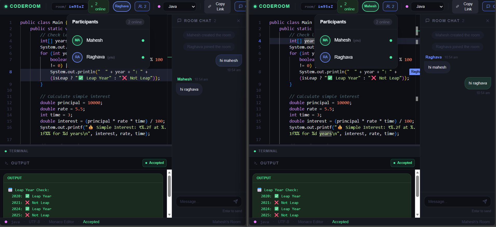

# CodeRoom — Real-Time Collaborative Code Editor

A browser-based collaborative IDE where developers pair-program live. Create a room, share the URL, and everyone sees each other's keystrokes in real time — like Google Docs for code.

## Demo

> Two developers coding together in real-time, seeing each other's cursors and keystrokes instantly



---

## Features

- **Live code sync** — conflict-free real-time keystroke sync via Socket.io
- **Monaco Editor** — the VS Code engine with full syntax highlighting
- **7 languages** — JavaScript, TypeScript, Python, Rust, Go, C++, Java
- **Live cursors** — see collaborators' cursor positions with floating name labels
- **Sandboxed execution** — run code via OneCompiler API with JDoodle fallback
- **Room chat** — persistent chat history per room with system messages
- **Presence** — live participant list with unique colors per user
- **Auto-expiry** — rooms auto-delete after 24 hours via MongoDB TTL index
- **Code preservation** — each language remembers its own code when switching
- **Shareable URLs** — join any room instantly via `/room/:id`

---

## How It Works

```
User creates room
       ↓
Shares URL with collaborator
       ↓
Both open Monaco Editor
       ↓
Keystrokes sync via Socket.io
       ↓
Yjs CRDT handles concurrent edits
       ↓
Cursors appear with name tags
       ↓
Run code → OneCompiler API → JDoodle fallback
       ↓
Output appears in both screens instantly
```

---

## What CodeRoom Enables

| Feature | Description |
|---|---|
| 🔄 Pair Programming | Two developers coding together from anywhere |
| 📝 Technical Interviews | Live coding with shared editor |
| 🎓 Student Collaboration | Group assignments with chat + code |
| 🚀 Quick Prototyping | Share code instantly without setup |

---

## Tech Stack

| Layer | Technology |
|---|---|
| Frontend | React 18, Vite, Tailwind CSS |
| Editor | Monaco Editor (`@monaco-editor/react`) |
| Real-time | Socket.io (WebSocket + polling), Yjs CRDT |
| Backend | Node.js, Express |
| Database | MongoDB Atlas + Mongoose |
| Execution | OneCompiler API → JDoodle (fallback) |
| Deployment | Render (frontend static + backend web) |

---

## Project Structure

```
CodeRoom/
├── client/                  # React frontend (Vite)
│   └── src/
│       ├── pages/
│       │   ├── Home.jsx     # Create / Join room with 3D flip card
│       │   └── Room.jsx     # Main editor view
│       ├── components/
│       │   ├── Editor.jsx   # Monaco Editor + remote cursor decorations
│       │   ├── RemoteCursor.jsx  # Floating username labels overlay
│       │   ├── PresenceBar.jsx   # Top bar — users, language, run button
│       │   ├── Toolbar.jsx       # Language selector
│       │   ├── Chat.jsx          # Room chat panel
│       │   └── Output.jsx        # Execution result terminal
│       ├── hooks/
│       │   ├── useSocket.js      # Socket.io singleton connection
│       │   ├── useRoom.js        # Room state, sync, events
│       │   └── useExecution.js   # Code execution request + result
│       └── utils/
│           ├── languages.js      # Language configs + defaults
│           ├── ot.js             # Monaco delta helpers
│           └── env.js            # Vite env vars (dev vs prod URLs)
├── server/                  # Node.js + Express backend
│   └── src/
│       ├── index.js         # Express app + HTTP server
│       ├── socket.js        # Socket.io init + heartbeat
│       ├── handlers/
│       │   ├── codeSync.js  # Code change + language sync
│       │   ├── cursorSync.js # Cursor position relay
│       │   ├── presence.js  # Join / leave / user list
│       │   └── chat.js      # Chat messages + history
│       ├── routes/
│       │   ├── rooms.js     # REST: create, fetch
│       │   └── execute.js   # REST: proxy to execution APIs
│       ├── models/
│       │   ├── Room.js      # Mongoose room schema (TTL index)
│       │   └── Message.js   # Mongoose message schema
│       ├── middleware/
│       │   ├── rateLimiter.js   # Execution rate limiting
│       │   └── errorHandler.js  # Global error handler
│       └── db/
│           └── connect.js   # MongoDB connection
└── shared/
    ├── constants.js         # Socket event names + language configs
    └── types.js             # JSDoc type definitions
```

---

## Getting Started

### Prerequisites

- Node.js 18+
- MongoDB Atlas account (free tier)
- OneCompiler API key (free — 100 credits on signup)

### 1. Clone the repository

```bash
git clone https://github.com/MaheshRaghava/CodeRoom.git
cd CodeRoom
```

### 2. Install dependencies

```bash
npm run install:all
```

### 3. Set up environment variables

Create `server/.env`:

```env
PORT=3001
NODE_ENV=development
MONGO_URI=mongodb+srv://<username>:<password>@cluster.mongodb.net/coderoom
CLIENT_URL=http://localhost:5173

# OneCompiler API (primary)
ONECOMPILER_API_KEY=your_onecompiler_key
ONECOMPILER_API_URL=https://api.onecompiler.com/api/v1/run

# JDoodle API (fallback)
JDOODLE_CLIENT_ID=your_jdoodle_client_id
JDOODLE_CLIENT_SECRET=your_jdoodle_client_secret
JDOODLE_API_URL=https://api.jdoodle.com/v1/execute
```

### 4. Run locally

```bash
npm run dev
```

- Frontend → `http://localhost:5173`
- Backend → `http://localhost:3001`

### 5. Test it

1. Open two browser windows
2. Create a room with your name
3. Share the URL with a friend (or second browser)
4. Start typing — watch it sync live
5. Run code — see output in both screens
6. Change language — both editors switch automatically
7. Move cursor — see the other user's name tag float

---

## Deployment (Render)

### Backend (Web Service)

| Setting | Value |
|---|---|
| Root Directory | `server` |
| Build Command | `npm install` |
| Start Command | `node src/index.js` |
| Health Check | `/health` |

Add all environment variables from `server/.env` in the Render dashboard.

### Frontend (Static Site)

| Setting | Value |
|---|---|
| Root Directory | `client` |
| Build Command | `npm install && npm run build` |
| Publish Directory | `dist` |
| Rewrite Rule | `/* → /index.html` |

Add environment variables:
- `VITE_API_URL` = `https://your-backend.onrender.com`
- `VITE_SOCKET_URL` = `https://your-backend.onrender.com`

Deploy backend first, copy its URL, then deploy frontend.

---

## Environment Variables Reference

| Variable | Description | Required |
|---|---|---|
| `PORT` | Server port (default: 3001) | ❌ |
| `MONGO_URI` | MongoDB Atlas connection string | ✅ |
| `CLIENT_URL` | Frontend URL for CORS | ✅ |
| `ONECOMPILER_API_KEY` | RapidAPI key for OneCompiler | ✅ |
| `ONECOMPILER_API_URL` | OneCompiler API endpoint | ✅ |
| `JDOODLE_CLIENT_ID` | JDoodle client ID (fallback) | ✅ |
| `JDOODLE_CLIENT_SECRET` | JDoodle client secret | ✅ |
| `JDOODLE_API_URL` | JDoodle API endpoint | ✅ |

---

## Architecture Decisions

**Why Yjs CRDT instead of custom OT?**
Operational Transform (OT) is complex to implement correctly. Yjs provides a production-tested Conflict-free Replicated Data Type (CRDT) that handles concurrent edits automatically without server-side transformation logic.

**Why Socket.io instead of plain WebSockets?**
Socket.io provides automatic reconnection, fallback to polling (works through corporate firewalls), and room management out of the box — critical for collaborative apps where network stability varies.

**Why OneCompiler as primary with JDoodle fallback?**
OneCompiler offers 100 free credits/day with JavaScript and TypeScript support. JDoodle provides a reliable 20/day fallback, ensuring the "Run" button never fails completely.

**Why per-language code preservation?**
Users expect their work to persist when switching between languages. Storing code per language in `codePerLanguage` ref (client) and `perLanguageCode` (MongoDB) provides instant switching + permanent storage.

**Why Monaco Editor over CodeMirror?**
Monaco is the VS Code engine — the same editor millions of developers use daily. It provides professional syntax highlighting, IntelliSense, and keyboard shortcuts users already know.

---

## Why Build This When VS Code Live Share Exists?

VS Code Live Share requires both users to have VS Code installed. CodeRoom runs entirely in the browser — zero setup, zero installation.

More importantly, CodeRoom is programmable infrastructure:

- **Custom execution environment** — run code in sandboxed containers with your own rules
- **Language learning platform** — embed in tutorials with pre-written code templates
- **Interview platforms** — control the environment, record sessions
- **Embeddable widget** — drop a collaborative editor into any web app

---

## Author

**Mahesh Raghava**

- GitHub: [@MaheshRaghava](https://github.com/MaheshRaghava)
- LinkedIn: [linkedin.com/in/mahesh-raghava](https://linkedin.com/in/mahesh-raghava)
- Email: maheshraghavak@gmail.com

---

## License

MIT License — feel free to fork, extend, and build on top of this.
```

---